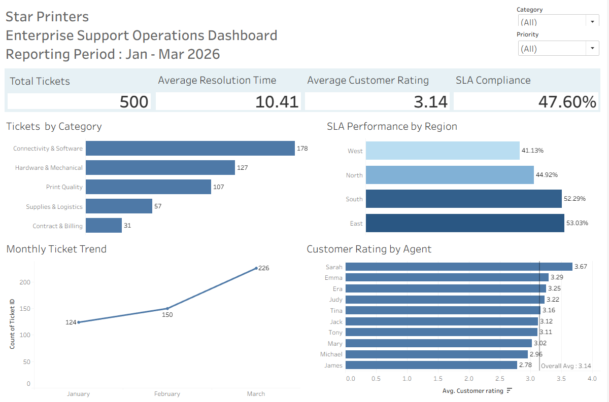

# Star-Printers-support-analytics

## Project Overview

This project analyzes 500 simulated enterprise support tickets to evaluate SLA performance, support workload, issue trends, resolution efficiency, customer satisfaction, and customer ticket volumes.
The analysis follows an end-to-end business analytics workflow using Excel, MySQL, and Tableau, from data validation and KPI analysis through interactive visualization and executive reporting.

## Business Problem
Star Printers experienced an increase in support requests across multiple enterprise customers. Management lacked a centralized view of operational performance, making it difficult to monitor SLA compliance, identify recurring issues, evaluate workload distribution, and prioritize areas requiring further investigation.

## Project Objectives
- Analyze support ticket trends.
- Measure and compare SLA compliance across operational areas.
- Identify high-volume issue categories and departments.
- Evaluate resolution time and customer satisfaction.
- Analyze customer ticket volumes.
- Provide management with actionable operational insights.

## Data Overview
The analysis is based on 500 simulated enterprise support tickets covering January to March 2026. 

The dataset includes information such as: 
- Ticket_ID and Customer Account
- Created and Closed Dates
- Category and Subcategory
- Priority
- Agent and Department
- Resolution time
- SLA target and SLA status
- Customer rating
- Region

## Tools Used
- **Microsoft Excel** - Data exploration, data validation, KPI analysis, PivotTables, PivotCharts, and executive dashboard development
- **MySQL / MySQL Workbench** - Data cleaning, validation, querying, filtering, grouping, conditional aggregation, subqueries, CTEs, date analysis, joins, and business analysis
- **Tableau** - KPI visualization, interactive dashboard development, trend analysis, filters, dashboard actions, and performance benchmarking
- **GitHub** - Project documentation and portfolio presentation

## Project Workflow
1. Reviewed and validated the support ticket dataset.
2. Built an Excel executive dashboard to analyze operational KPIs and trends.
3. Imported and validated the dataset in MySQL.
4. Performed SQL analysis covering SLA performance, ticket volume, resolution efficiency, customer satisfaction, and operational trends.
5. Developed an interactive Tableau executive dashboard with KPI tracking, filters, trend analysis, and performance comparisons.
6. Documented the complete analysis, findings, and dashboards in GitHub.

## Excel Executive Dashboard
The Excel dashboard provides an executive view of support operations, including SLA compliance, ticket volumes, resolution performance, customer satisfaction, and operational trends.

## SQL Analysis
The validated support ticket dataset was imported into MySQL for further analysis and cross-validation of the Excel findings.

The SQL analysis includes: 
- Data validation and KPI calculations
- Ticket volume analysis by category and department
- Regional SLA performance analysis
- Customer and agent performance analysis
- Monthly ticket volume and SLA trend analysis
- Subqueries and Common Table Expressions (CTEs)
- JOIN analysis using agent reference data
- Data quality investigation of resolution-time discrepancies

### Key SQL Findings
- Overall SLA compliance was **47.60%**.
- **West Region** recorded the lowest SLA compliance at **41.13%**.
- **Connectivity & Software** generated the highest ticket volume with **178 tickets**.
- **Hardware & Mechanical** had the highest average resolution time at **14.91 hours**.
- **Amazon Ltd** generated the highest customer ticket volume with **98 tickets**.
-  Average customer satisfaction across the dataset was **3.14**.
-  Ticket volume increased from **124 in January to 226 in March**, while SLA compliance improved from **45.97% to 48.67%**.

### Data Quality Observation
Validation identified that the supplied `Resolution_Time` values do not consistently reconcile with elapsed hours calculated from `Created_Date` and `Closed_Date`. This discrepancy was retained as a documented data-quality observation rather than assuming a business definition that was not provided.

## Tableau Executive Dashboard
An interactive Tableau dashboard was developed to provide management with a consolidated view of enterprise support operations.

The dashboard focuses on four core KPIs: 
- Total Tickets: 500
- SLA Compliance: 47.60%
- Average Resolution Time: 10.41 hours
- Average Customer Rating: 3.14

### Dashboard Features
- Ticket volume analysis by issue category
- Regional SLA performance comparison
- Monthly ticket volume trend analysis
- Customer rating comparison by support agent
- Overall customer rating benchmark
- Interactive Category and Priority filters
- Region-based dashboard filtering through chart interaction

### Tableau Dashboard

### Key Insights
- Ticket volume increased from 124 in January to 150 in February and 226 in March, indicating a substantial increase in support demand.
- Connectivity & Software generated the highest ticket volume with 178 tickets.
- SLA Compliance varied considerably by region, ranging from 41.13% in West to 53.03% in East.
- Overall SLA compliance was 47.60%, highlighting an important area for operational improvement.
- Average customer rating was 3.14, with noticeable variation in performance across support agents.
- The dashboard enables management to investigate performance dynamically using Category, Priority, and Region interactions.

### Business Recommendations
- Investigate the operational drivers behind the West region's lower SLA compliance.
- Prioritize root-cause analysis for Connectivity & Software issues due to their high ticket volume.
- Review staffing and support capacity against the significant increase in ticket demand from January to March.
- Examine agent-level customer rating differences to identify coaching opportunities and transferable best practices.
- Investigate the documented resolution-time data discrepancy before using the field for operational SLA decisions.
