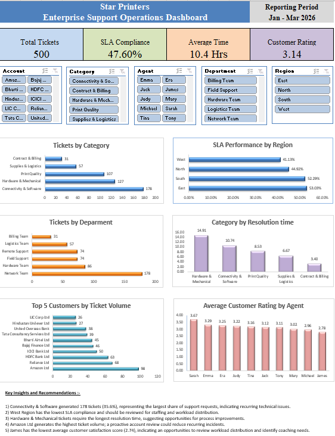

# Star-Printers-support-analytics

## Project Overview
This project simulates an enterprise support operations environment and demonstrates how Business Analysts can transform operational data into actionable insights through data validation, analysis, visualization, and executive reporting. 
This project analyzes 500 simulated enterprise support tickets to evaluate SLA performance, support workload, issue trends, resolution efficiency, customer satisfaction, and customer ticket volumes.

## Business Problem
Star Printers experienced an increase in support requests across multiple enterprise customers. Management lacked a centralized view of operational performance, making it difficult to monitor SLA compliance, identify recurring issues, evaluate workload distribution, and prioritize areas requiring further investigation.

## Project Objectives
- Analyze support ticket trends.
- Measure and compare SLA compliance across operational areas.
- Identify high-volume issue categories and departments.
- Evaluate resolution time and customer satisfaction.
- Analyze customer ticket volumes.
- Provide management with actionable operational insights.

## Data Overview
The analysis is based on 500 simulated enterprise support tickets covering January to March 2026. 

The Dataset includes information such as: 
- Ticket_ID and Customer Account
- Created and Closed Dates
- Category and Subcategory
- Priority
- Agent and Department
- Resolution time
- SLA target and SLA status
- Customer rating
- Region

## Tools Used
- **Microsoft Excel** - Data exploration, validation, KPI analysis, PivotTables, and executive dashboard development
- **MySQL/MySQL Workbench** - Data cleaning, validation, querying, aggregation, and business analysis
- **SQL** - Filtering, grouping, conditional aggregation, subqueries, CTEs, date analysis, and joins
- **Tableau** - Interactive dashboard development (next phase)
- **GitHub** - Project documentation and portfolio presentation

## Project Workflow
1. Reviewed and validated the support ticket dataset.
2. Built an Excel executive dashboard to analyze operational KPI and trends.
3. Imported and validated the dataset in MySQL.
4. Performed SQL analysis covering SLA performance, ticket volume, resolution efficiency, customer satisfaction, and operational trends.
5. Documented the project and analysis in GitHub.
6. Develop an interactive Tableau dashboard in the next phase.

## Excel Executive Dashboard
The Excel dashboard provides an executive view of support operations, including SLA compliance, ticket volumes, resolution performance, customer satisfaction, and operational trends.

## SQL Analysis
The validated support ticket dataset was imported into MySQL for further analysis and cross-validation of the Excel findings.

The SQL analysis includes: 
- Data validation and KPI calculations
- Ticket volume analysis by category and department
- Regional SLA performance analysis
- Customer and agent performance analysis
- Monthly ticket volume and SLA trend analysis
- Subqueries and Common Table Expressions (CTEs)
- JOIN analysis using agent reference data
- Data quality investigation of resolution-time discrepancies

### Key SQL Findings
- Overall SLA compliance was **47.60%**.
- **West Region** recorded the lowest SLA compliance at **41.13%**.
- **Connectivity & Software** generated the highest ticket volume with **178 tickets**.
- **Hardware & Mechanical** had the highest average resolution time at **14.91 hours**.
- **Amazon Ltd** generated the highest customer ticket volume with **98 tickets**.
-  Average customer satisfaction across the dataset was **3.14**.
-  Ticket volume increased from **124 in January to 226 in March**, while SLA compliance improved from **45.97% to 48.67%**.

### Data Quality Observation
Validation identified that the supplied `Resolution_Time` values do not consistently reconcile with elapsed hours calculated from `Created_Date` and `Closed_Date`. This discrepancy was retained as a documented data-quality observation rather than assuming a business definition that was not provided.
